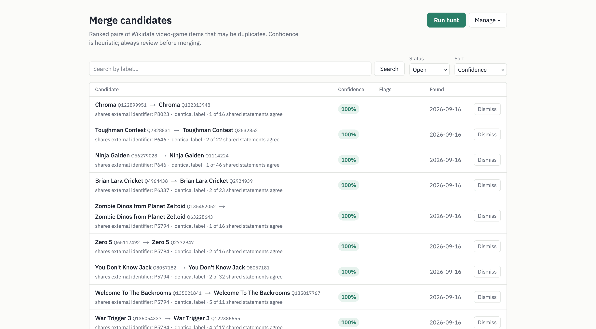

# M&A: A Wikidata Merge Assistant



Compares two Wikidata items and groups their labels, aliases, sitelinks and
statements into identical / similar / distinct / one-sided, flagging anything
that would block a merge. Candidate pairs come from a nightly hunt over a local
mirror of Wikidata items (loaded from the weekly entity dump); logged-in users
review them and merge or mark them as different, editing Wikidata directly.

## Toolchain

React 19 + TypeScript 7 SPA on the [Vite+](https://viteplus.dev) unified toolchain
(the `vp` CLI), a [Hono](https://hono.dev) (Node) API server, and
[Drizzle](https://orm.drizzle.team) on **MariaDB**. Managed with
[pnpm](https://pnpm.io); designed to run on [Wikimedia Toolforge](https://wikitech.wikimedia.org/wiki/Help:Toolforge).

## Development

Needs a local MariaDB. On macOS:

```sh
brew install mariadb && brew services start mariadb
# Homebrew MariaDB uses unix_socket auth for root, so connect as your own user
# (no -u root). The utf8mb4_bin collation is required — see the note below.
mariadb -e "CREATE DATABASE mergers CHARACTER SET utf8mb4 COLLATE utf8mb4_bin;
  CREATE USER 'mergers'@'localhost' IDENTIFIED BY 'mergers';
  GRANT ALL ON mergers.* TO 'mergers'@'localhost';"
```

The database is created with the **`utf8mb4_bin`** collation (not the usual
`utf8mb4_unicode_ci`): every string column inherits it, so comparisons are exact
(case- and accent-sensitive). This is correct for external identifiers — two IDs
that differ only in case are genuinely different — and restores the binary
comparison the original SQLite schema used. Candidate search still folds case,
because it lowercases both sides explicitly (`lower(primary_label) LIKE …`). On
Toolforge, create the ToolsDB database with the same `COLLATE utf8mb4_bin`.

```sh
cp .env.example .env   # local DB defaults match the setup above
pnpm install
pnpm db:migrate        # apply migrations
pnpm seed              # seed from seed-data/wikidata_games.json (SEED_LIMIT=2000 for a slice)
pnpm dev               # Vite SPA (proxying /api) + the Hono server on :8000
```

## Commands

```sh
pnpm build             # build the SPA to dist/client (vp build)
pnpm start             # run the production server (serves API + dist/client)

pnpm db:generate       # generate a migration from db/schema.ts (drizzle-kit)
pnpm db:migrate        # apply pending migrations
pnpm seed              # load the vglist SPARQL dump into the DB (quick dev DB)
pnpm import-items Q1 Q2 # import specific items live from Special:EntityData

pnpm job:import-dump   # load the mirror from the Wikidata entity JSON dump
pnpm job:hunt          # run the duplicate-candidate hunt once
pnpm job:sync-properties / :sync-entity-labels
pnpm job:resolve-sitelinks / :resolve-creations
pnpm job:prune-sessions # delete expired login sessions
```

Formatting, linting, testing, and type-checking go through the `vp` CLI directly:

```sh
vp check       # format, lint, and type-check in one pass
vp test        # run tests with Vitest (DB-backed tests are skipped unless DB_TEST=1)
```

### DB-backed tests

The `*.db.test.ts` files under `server/` exercise the API routes and the hunt
against a real MariaDB. They are skipped by default because they **truncate
every table** between tests. To run them, point them at a dedicated database
(the name must contain `test`; the migrations are applied automatically):

```sh
mariadb -e "CREATE DATABASE test_mergers CHARACTER SET utf8mb4 COLLATE utf8mb4_bin;"
DB_TEST=1 DB_NAME=test_mergers vp test
```

(The `mergers` user created above can already create `test_*` databases.) CI runs
them against a MariaDB service container, together with a from-scratch migration
run and a schema-drift check — see `.github/workflows/ci.yml`.

## Authentication

Login is **Wikimedia OAuth 2.0** (authorization code + PKCE, confidential
client). Anyone can browse candidates; dismissing/reopening and the Wikidata
edits below need a login, and the hunt / reset / sync triggers are limited to
the user ids in `ADMIN_USERS`. With none of the `OAUTH_*` variables set the app
runs read-only and the login link is hidden.

1. Register a consumer at
   [Special:OAuthConsumerRegistration/propose/oauth2](https://meta.wikimedia.org/wiki/Special:OAuthConsumerRegistration/propose/oauth2)
   on meta.wikimedia.org: OAuth 2.0, **not** owner-only, callback URL exactly
   `<BASE_URL>/api/auth/callback`, applicable projects `wikidatawiki` (and
   `testwikidatawiki` for dev), grants "Basic rights" + "Edit existing pages".
   Consumers that request edit grants are approved by hand, which can take a few
   days; an owner-only consumer works for the owner immediately in the meantime.
2. Set the variables listed under `# --- authentication` in `.env.example`
   (`.env` locally; `toolforge envvars create` on Toolforge). `SESSION_SECRET`
   signs the login-state cookie; `TOKEN_ENC_KEY` encrypts the stored OAuth
   tokens; `BASE_URL` is the public origin (cookies are `Secure` iff https).
3. Put your own central user id in `ADMIN_USERS` to see the hunt/maintenance
   controls.

Session cookies are `HttpOnly; SameSite=Lax`, the DB stores only their hash, and
state-changing API calls must carry a same-origin `Sec-Fetch-Site`/`Origin`. The
nightly `prune-sessions` job deletes expired sessions.

## Editing Wikidata

Every edit is made **under the logged-in user's own account** through their
OAuth grant (`server/wikidata-client.ts`) — never a shared or bot account, never
with `bot=1`. Wikidata enforces the user's real rights; the app only refuses up
front for accounts its profile snapshot says are blocked.

- **Merge** (`POST /api/candidates/:id/merge`) runs `wbmergeitems` in the
  app's order — the higher QID into the lower — with an edit summary crediting
  the tool. The only `ignoreconflicts` kind ever sent is `description` (the
  survivor keeps its description, the merged-away item's is dropped). Because
  that leaves the ignored description on the source, `wbmergeitems` won't empty
  it and so won't redirect it; the app then finishes the job the way a human
  does — clears the source (against the merge revision, so a concurrent edit
  fails rather than being wiped) and redirects it to the survivor. This is best
  effort: if it fails the merge still stands, its resolution noting that the
  source item was not redirected. Clashing sitelinks and items that link to each
  other are never overridden: the confirm dialog warns when the mirror predicts one, Wikidata
  refuses the merge, and the user fixes the items by hand first. The one clash
  the app clears itself is a sitelink to a page that redirects to the other
  item's page on the same wiki: once nothing else blocks the merge, it asks that
  wiki's API (live, not the nightly `sitelink_pages` data) and, if the redirect
  is confirmed, removes that sitelink with `wbsetsitelink` before merging. Each
  removal is its own edit, listed in the merge's audit row and on the result. On success the
  candidate becomes `merged` (with both revision ids linked from the page), the
  merged-away item is dropped from the mirror so the hunt stops pairing it, and
  any other open candidate that referenced it is settled as "merged elsewhere".
  A merge takes a short `merging` claim on the row first, so a double click or a
  second tab can't submit it twice; a claim abandoned by a crash goes stale
  after ten minutes. If the request times out, the app checks whether the
  source became a redirect before deciding: a merge that did go through is
  settled as usual, and one that can't be checked keeps its claim until it
  goes stale rather than inviting a retry against a redirect.
- **Mark as different** (`POST /api/candidates/:id/different`) adds a
  `different from` (P1889) statement in each direction via `wbcreateclaim`,
  mirrors it locally, and dismisses the candidate. It takes the same claim as
  a merge, so two submits can't each add their own copy of the statements.

Requests carry `maxlag=5` and an `assert=user&assertuser=` check; the client
retries once on `badtoken` and once on `maxlag`, drops the stored tokens and
asks for a re-login when the grant was revoked, and surfaces Wikidata's own
error text (`permissiondenied`, `blocked`, conflicts, …) verbatim. Every attempt
— success or failure — is recorded in `wikidata_edits` with the user, the
revision ids, and any error. Edits are rate limited per user
(`EDIT_RATE_LIMIT`/minute, default 10). Point `WIKIDATA_API_URL` at
`https://test.wikidata.org/w/api.php` to develop against Test Wikidata (the
consumer must list `testwikidatawiki`; QIDs there won't match the mirror).

## Loading the mirror from the Wikidata dump

`pnpm job:import-dump` (`jobs/import-dump.ts` → `server/dump-import.ts`) streams
the Wikidata **entity JSON dump** once and upserts every item whose `instance of`
(best rank) is one of the classes in `src/lib/import-classes.ts` (video games,
films and TV series, music, anime and manga, companies, …; exact QIDs, no
subclasses), together with its external ids and the
`properties` table (labels, datatypes, formatter URLs). Items carry their
descriptions, aliases and sitelinks (so there is no separate description sync:
until the first full pass has run, the comparison view shows no descriptions),
and time values keep their precision. It never talks to QLever. After a complete pass it deletes items the dump no longer
contains (merged away, deleted, retyped) and settles their open candidates; it
refuses to drop more than 20% of the mirror at once unless `DUMP_PRUNE_FORCE=1`.

On Toolforge the dump is on the read-only NFS mount, which a build-service job
only sees with `--mount all`:

```sh
# quick timing/validation run: stop after 2000 items, no pruning
toolforge envvars create DUMP_LIMIT 2000
toolforge jobs run import-dump-test --image tool-mna/tool-mna:latest \
  --command "node --max-old-space-size=3072 jobs/import-dump.ts" --mount all --mem 4Gi --cpu 1 --emails onfinish
toolforge envvars delete DUMP_LIMIT
# full pass (a few hours; 156 GB gzip, ~1.6 TB inflated, one CPU)
toolforge jobs run import-dump --image tool-mna/tool-mna:latest \
  --command "node --max-old-space-size=3072 jobs/import-dump.ts" --mount all --mem 4Gi --cpu 1 --emails onfinish
```

`jobs.yaml` also schedules it weekly (Wednesdays, after the Tuesday dump).
Locally, point `WIKIDATA_JSON_DUMP` at any `.json.gz` / `.json` in the same
format (one entity per line; the `.bz2` dump is refused as far too slow). The
older `pnpm seed` path (the vglist SPARQL blob) still works for a quick dev DB.

### Splitting the pass across jobs

The pass is CPU-bound on one core (inflate plus the line scan), and a job can't
have more than one CPU, but the dump's `.gz` is a concatenation of ~2,000
independent gzip members (the generator gzips each 65k-entity batch on its own
and `cat`s them together), so the file can be read in slices. `--shard i/N`
reads the N-th of the compressed bytes, widened to whole members, so N jobs
with the same N cover the file exactly once:

```sh
for i in 1 2 3 4; do
  toolforge jobs run import-dump-$i --image tool-mna/tool-mna:latest \
    --command "node jobs/import-dump.ts --shard $i/4" --mount all --mem 1Gi --cpu 1 --emails onfailure
done
```

Each slice upserts on its own and stamps its items with the dump (the date in
the file name); the pruning happens once, by whichever job completes the set
for that dump (`dump_import_runs`). A retried slice just re-records itself.
Wall time is about 1/N of a single pass, but the default tool quota is 2 CPUs
in total (shared with the web service), so running several slices at once
needs a [quota increase](https://wikitech.wikimedia.org/wiki/Help:Toolforge/Kubernetes#Quotas).
Without `--shard` the job reads the whole file, which is `--shard 1/1`.

## Resolving sitelink redirects

When two items link different pages on the same wiki, Wikidata refuses to merge
them — but often one page is only a redirect to the other. The dump's "sitelink
to redirect" badges don't say where a redirect points, and they're missing on
pages that became redirects after being linked. So `pnpm job:resolve-sitelinks`
(`jobs/resolve-sitelinks.ts` → `server/sitelink-redirects.ts`, nightly after the
hunt) looks up every clashing sitelink on an open candidate in that wiki's
`page` / `redirect` tables on the [Wiki
Replicas](https://wikitech.wikimedia.org/wiki/Help:Toolforge/Database) and
stores the answer in `sitelink_pages`. It connects to
`<wiki>.analytics.db.svc.wikimedia.cloud` (database `<wiki>_p`) with the tool's
`TOOL_REPLICA_USER` / `TOOL_REPLICA_PASSWORD`, one wiki at a time. Pages are
re-checked after a week.

The replicas are only reachable from Toolforge. To run the job from a dev
machine, tunnel through the bastion and point `REPLICA_HOST` / `REPLICA_PORT` /
`REPLICA_DB` at the tunnel (`{wiki}` is replaced with the site id), with the
replica credentials from the tool's `replica.my.cnf` in the `TOOL_REPLICA_*`
variables.

## Item creators

Reviewers find it useful to know who created each item in a pair, when, and
how: a duplicate made by a drive-by account or a bulk import is more likely an
accident than one made by an editor they know. The detail page shows each
item's creator (with their edit count and bot flag), the creation date, and the
tool behind it when the edit summary or tags name one (QuickStatements batch,
OpenRefine / EditGroups batch, Mix'n'match, …).

`pnpm job:resolve-creations` (`jobs/resolve-creations.ts` →
`server/item-creations.ts`, nightly after the hunt) reads each open candidate's
items' first revision from the `wikidatawiki` replica into `item_creations`,
with the same replica settings as above. Only new items are read, plus rows
older than 30 days, to refresh the creator's stats. A pair viewed before the
job has reached it is looked up through the Action API instead
(`GET /api/candidates/:id/creations`) and cached the same way.

## Deploying to Toolforge

The Build Service builds the image from the GitHub repo directly — it clones the
repo itself, so there is no checkout on the bastion to `git pull`; each build
pulls the latest default branch (pass `--ref <branch>` to build another). Watch
it with `toolforge build show`; when it succeeds `toolforge images` lists the
`tool-mna/tool-mna:latest` image the jobs and web service reference:

```sh
toolforge build start https://github.com/connorshea/mergers-and-acquisitions
```

Then apply migrations as a one-off job, load the mirror with the `import-dump`
job above, start the web service (`toolforge webservice buildservice start
--mount none`; the build service requires an explicit mount flag, and the web
process needs no NFS), and load the schedule with `toolforge jobs load
jobs.yaml`. One-off jobs keep their
name after finishing, so `toolforge jobs delete migrate` before rerunning:

```sh
toolforge jobs run migrate --image tool-mna/tool-mna:latest \
  --command "node scripts/migrate.ts" --wait
```

Job and Procfile commands call `node` directly rather than `npm run …`: the
launch image has npm but not pnpm, and npm 11 refuses to run scripts because
`devEngines.packageManager` (set for Vite+) names pnpm.

The DB is a ToolsDB MariaDB database, created with
`CHARACTER SET utf8mb4 COLLATE utf8mb4_bin` (see the collation note above);
connection details come from the tool's credentials via the `DB_*` env vars.

The server checks the schema before it binds its port (`server/preflight.ts`):
if the database has fewer migrations applied than `db/migrations` contains, it
logs `DB schema is behind: N migrations in db/migrations, M applied.` and exits
with status 1, so run the migrate job before (re)starting the web service after a
deploy that adds a migration. An unreachable database is retried a few times and
then also exits, leaving the restart to Kubernetes.
